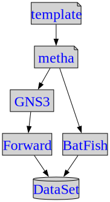

# Roadmap to Create a Network Dataset for feature detection

## Description

This document illustrate the possible roadmap of creating the network dataset for network feature detection, which is a directed study project under EECS399-235 as described [here](eecs399-235.md). 

The students will pick up one of the interested topics in the roadmap diagram below and started their study from that block first:
- Metha:  A network automation frameework that can be modified for our network data creation 
- GNS3: an open source network emulator that use vendor router OS to emulate real production network topologies in a cluster of computers.  
- Forward Networks: an commercial software that acting as a ``camera'' for this project to take digital twin of the auto-generated networks by Metha in GNS3.
- BatFish: an open source project that could simulate certain network behaviors from Metha. 
- Dataset: this would be our output of the network dataset, designed and generated from Metha.

## Roadmap Diagram

